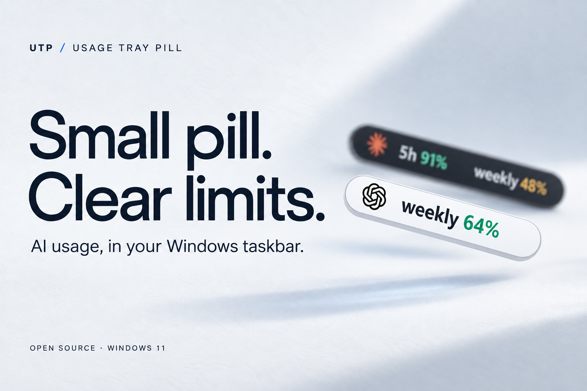
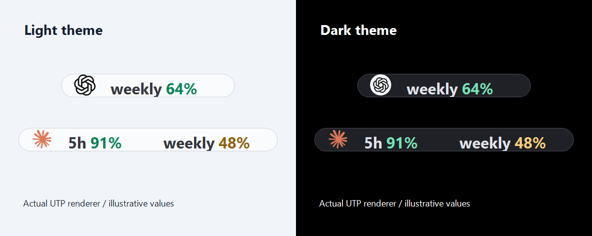
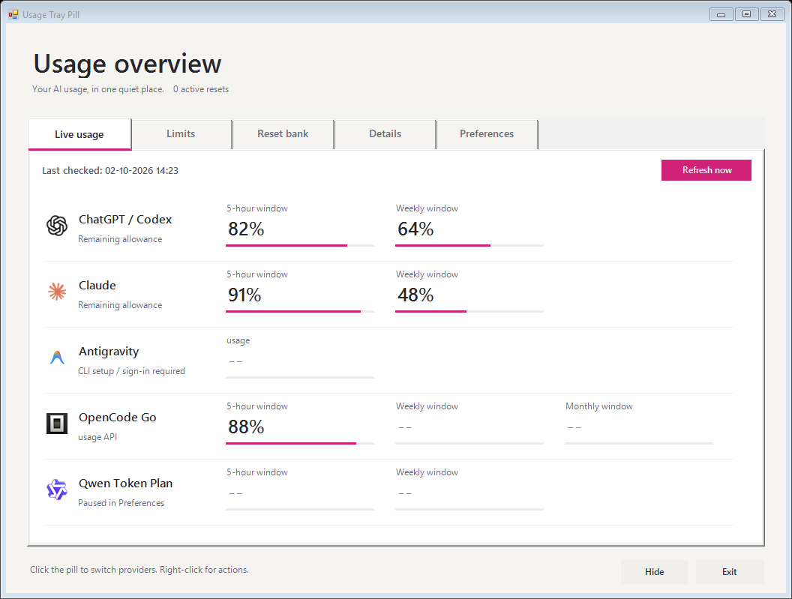

<p align="center">
  
</p>

<h1 align="center">Usage Tray Pill</h1>
<p align="center">Your AI usage, one glance away.</p>
<p align="center">
  <a href="https://github.com/Novendum/usage-tray-pill/actions/workflows/test.yml"></a>
  <a href="LICENSE"></a>
  
</p>



A small Windows utility for checking remaining **Codex, Claude, Antigravity, OpenCode Go and Qwen Token Plan** allowances from your taskbar. Click to switch providers. Open the overview when you want the details.

**[Quick start](#quick-start)** · **[Provider setup](docs/PROVIDERS.md)** · **[What's changed](CHANGELOG.md)** · **[Report a bug](https://github.com/Novendum/usage-tray-pill/issues)**

## What's new in rc.4

**Quieter in the background. Clearer when data is delayed.** This stability update stops AGY's quota checks from opening an updater terminal, gives temporary Claude failures a clearly marked cache, and keeps one failed refresh from interrupting the other providers. Fullscreen hiding stays on by default.

[Download v0.1.0-rc.4](https://github.com/Novendum/usage-tray-pill/releases/tag/v0.1.0-rc.4) · [Read the changes](CHANGELOG.md#010-rc4---2026-10-04)

## At home in your taskbar



- **A clear glance.** Bold text, smooth rounded edges and crisp icons. The pill follows your Windows taskbar's light or dark theme.
- **A quiet interaction.** Click to cycle providers, right-click for actions. No hover popup. Transitions respect Windows animation preferences.
- **Predictable visibility.** The pill hides when a full-screen app covers the primary taskbar and returns when the taskbar is exposed. You can disable full-screen hiding in Preferences.
- **Freshness you can understand.** Background collection, refresh controls and explicit unavailable states. Missing data appears as `--`.
- **Your choice of sources.** Select the Codex allowance bucket and enable optional integrations in Preferences. Disable OpenCode Go or Qwen without losing the saved connection.
- **Local by design.** Settings and caches stay on your PC. No UTP account or telemetry service. Provider requests use the connections described in [Privacy](PRIVACY.md).

## A closer look



The overview brings available allowance windows together, with separate Details and Preferences tabs. These images use **fictitious values** rendered by the actual app; setup-required and paused providers are shown deliberately. The cover is generated product artwork with illustrative values, not a pixel-exact screenshot.

## Quick start

You need **Windows 11**, **Windows PowerShell 5.1**, and a supported, signed-in provider. Configure only the providers you use.

1. [Download the source ZIP](https://github.com/Novendum/usage-tray-pill/archive/refs/heads/main.zip) and extract the **whole folder**, or clone this repository.
2. Review the scripts, then double-click **`Start-UsageTrayPill.cmd`**.
3. Right-click the pill to open its menu. Open the overview and Preferences to choose your sources.

No administrator rights are required. Keep the runtime `.ps1` and `.cs` files, launcher files and `assets` together; UTP runs from this folder.

| Provider | What you need | Integration |
| --- | --- | --- |
| ChatGPT / Codex | Signed-in Codex CLI or compatible ChatGPT desktop installation | Local Codex app-server; selectable allowance bucket |
| Claude | Claude Code statusline integration, or Claude Desktop usage history | Optional CLI quotas are experimental and off by default |
| Antigravity | Separately installed, signed-in Antigravity CLI | Read-only `/usage` command; desktop app alone is insufficient |
| OpenCode Go | Go subscription and a Go API key you supply | Official usage endpoint; off by default |
| Qwen Token Plan | Compatible QwenCloud plan and dashboard session | Experimental dashboard adapter; off by default |

Follow the [provider setup guide](docs/PROVIDERS.md) for connection steps, migration notes and known limitations. A provider's absence does not require installing it just to try UTP.

<details>
<summary><strong>Optional shortcuts and startup</strong></summary>

Run only the installers you want from Windows PowerShell in the extracted folder:

```powershell
.\Install-DesktopShortcut.ps1
.\Install-StartMenuShortcut.ps1
.\Install-Startup.ps1
```

Claude's statusline integration is separate:

```powershell
.\Install-ClaudeStatusLine.ps1
```

Installers preserve unrelated shortcuts and existing statuslines. Use `-Force` only when you deliberately want to replace one. Claude settings changes create a backup.

If your execution policy blocks reviewed scripts, you can allow them for the current terminal session:

```powershell
Set-ExecutionPolicy -Scope Process -ExecutionPolicy Bypass
```

This does not change the permanent user or machine policy.

</details>

<details>
<summary><strong>Updating and uninstalling</strong></summary>

Exit UTP before replacing its application files. Extract the complete update into the same folder, then launch it again. If you move the folder, recreate your shortcuts and Claude statusline integration from the new location.

OpenCode Go users migrating from the dashboard adapter must supply a Go API key through setup. Old encrypted cookie records are preserved but no longer used.

Remove the optional integrations independently:

```powershell
.\Uninstall-Startup.ps1
.\Uninstall-DesktopShortcut.ps1
.\Uninstall-StartMenuShortcut.ps1
.\Uninstall-ClaudeStatusLine.ps1
```

Settings and caches remain in `%APPDATA%\UsageTrayPill`. Delete that directory yourself only if you also want to remove settings, notes and saved UTP connections.

</details>

## Status and limitations

UTP is a **public open-source release candidate**. The repository contains the source; provider compatibility can change independently of UTP. See the [readiness record](docs/OPEN_SOURCE_READINESS.md) for what was tested and what remains open.

Most active collectors normally check once a minute; enabled Qwen checks every two minutes. Cache changes reach the UI on a 500 ms tick. These are polling intervals, not a promise of instant provider updates. Authentication errors pause collection, and temporary errors use bounded retry delays.

The [earlier demo](https://github.com/user-attachments/assets/1f7a0588-d80b-4f79-ab9f-c70e5b1f08a8) shows the original release-candidate design. The screenshots above represent the current code in this branch.

## Contribute

Bug reports, provider compatibility notes and focused pull requests are welcome. Please keep account data and credentials out of reports.

```powershell
.\Test-UsageTrayPill.ps1
```

Run tests in **Windows PowerShell 5.1**. Tests cover provider parsing, refresh lifecycle, interaction, DPI rendering and credential boundaries using isolated fixtures; passing offline tests does not prove every account or plan works.

[Contributing](CONTRIBUTING.md) · [Architecture](docs/ARCHITECTURE.md) · [Support](SUPPORT.md) · [Security](SECURITY.md) · [Privacy](PRIVACY.md)

## License and independence

UTP is unofficial and is not affiliated with or endorsed by the providers it displays.

Source: [MIT](LICENSE). The bundled Qwen Code indicator: [Apache-2.0](THIRD_PARTY_LICENSES/QWEN_CODE_APACHE-2.0.txt). Other runtime provider indicators come from installed applications, with a neutral fallback when absent. Names and trademarks belong to their respective owners. See [third-party notices](THIRD_PARTY_NOTICES.md) and [asset provenance](docs/ASSET_PROVENANCE.md).
