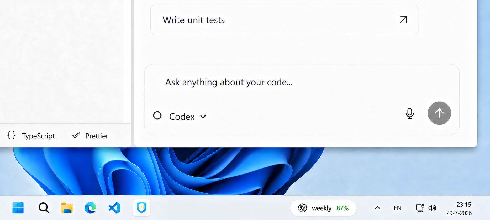

<p align="center">
  
</p>

# Usage Tray Pill (UTP)

Usage Tray Pill is an unofficial Windows 11 tray utility that shows remaining ChatGPT/Codex, Claude, Antigravity, OpenCode Go, and Qwen Token Plan usage in a compact taskbar pill.

UTP is not affiliated with, endorsed by, or sponsored by OpenAI, Anthropic, Google, OpenCode, Anomaly, Qwen, or Alibaba Cloud.

ChatGPT, Claude, Antigravity, and OpenCode indicators are loaded from applications already installed on the user's computer. The official Qwen Code icon is distributed under Apache-2.0 only as a small provider indicator. A neutral UTP fallback is shown when another installed icon cannot be found.

## Demo



https://github.com/user-attachments/assets/1f7a0588-d80b-4f79-ab9f-c70e5b1f08a8

[Download the demo video](docs/media/usage-tray-pill-demo.mp4)

## Current status

UTP is an open-source release candidate under active development. The reviewed source is prepared for public publication, while provider compatibility remains best-effort because provider-owned interfaces can change.

See [Open-Source Readiness](docs/OPEN_SOURCE_READINESS.md) for the current evidence and remaining manual compatibility checks.
Maintainers can use [Repository Settings](docs/REPOSITORY_SETTINGS.md) for the public GitHub configuration.

The first release uses an English Windows interface, source documentation, and contribution guidance. Additional UI languages may be added later.

## Features

- Compact weekly ChatGPT/Codex usage pill.
- Expandable Claude pill with 5-hour and weekly limits.
- Dynamic Antigravity pill with conservative model-family quota groups.
- Optional OpenCode Go pill with 5-hour, weekly, and monthly limits.
- Optional Qwen Token Plan pill with 5-hour and weekly limits.
- Click-only provider switching; hovering never changes the provider.
- Right-clicking the pill opens the same menu as the notification-area icon.
- Automatic hiding while a fullscreen application is active.
- Hidden startup without a visible PowerShell window.
- Light and dark UTP application icons.
- Local reset-bank and limit notes.
- Clean shutdown of the tray and its explicitly owned helper processes.

## Requirements

- Windows 11.
- Windows PowerShell 5.1.
- Codex CLI or the ChatGPT desktop app, signed in, for ChatGPT/Codex usage.
- Claude Code or Claude Desktop, signed in, for Claude usage.
- Antigravity, signed in and running, for Antigravity usage.
- An OpenCode Go workspace and an active dashboard session for OpenCode Go usage.
- A QwenCloud Token Plan and an active dashboard session for Qwen usage.

## Install

No administrator rights are required. Clone or download the repository, review the PowerShell scripts, then run:

```powershell
.\Install-DesktopShortcut.ps1
.\Install-StartMenuShortcut.ps1
.\Install-Startup.ps1
.\Install-ClaudeStatusLine.ps1
```

If Windows PowerShell blocks the reviewed scripts because of the current execution policy, allow them only for the current terminal session:

```powershell
Set-ExecutionPolicy -Scope Process -ExecutionPolicy Bypass
```

This does not change the permanent user or machine policy.

The installers refuse to overwrite unrelated shortcuts or an existing Claude statusline. Review the existing integration first; use `-Force` only when you intentionally want UTP to replace it. Every Claude settings change creates a timestamped backup.

Start UTP manually with:

```powershell
.\Start-UsageTrayPill.cmd
```

Remove automatic startup with:

```powershell
.\Uninstall-Startup.ps1
```

Remove the desktop shortcut with:

```powershell
.\Uninstall-DesktopShortcut.ps1
```

Remove the Start-menu shortcut with:

```powershell
.\Uninstall-StartMenuShortcut.ps1
```

Remove the UTP-managed Claude statusline with:

```powershell
.\Uninstall-ClaudeStatusLine.ps1
```

## Usage sources

### ChatGPT/Codex

UTP starts the locally installed `codex app-server --stdio` command and requests `account/rateLimits/read`. This local interface is experimental and may change between Codex releases.

### Claude

The supported source is the Claude Code statusline JSON. Install the UTP statusline integration with:

```powershell
.\Install-ClaudeStatusLine.ps1
```

Claude documents 5-hour and 7-day usage fields in its statusline. UTP may also read Claude Desktop's local usage history as a fallback.

### Antigravity

UTP reads model quota percentages and reset timestamps from the loopback-only language server started by the local Antigravity application. Antigravity must be running. UTP validates the process and its owned listening ports, keeps the temporary CSRF value in memory only, and stores no account details or provider tokens. There is deliberately no cloud API or OAuth fallback.

### OpenCode Go

OpenCode Go is disabled by default. Open the tray menu and choose **Set up OpenCode Go**. Supply the workspace ID from the dashboard URL and only the value of the signed-in dashboard cookie named `auth`.

UTP stores that cookie with Windows DPAPI for the current Windows user. It never reads OpenCode's `auth.json`, API keys, or browser cookie database. Every refresh is a direct HTTPS request to:

```text
https://opencode.ai/workspace/<workspace-id>/go
```

The dashboard currently exposes rolling 5-hour, weekly, and monthly usage. This is an undocumented dashboard format rather than a stable public API, so OpenCode changes may require an adapter update. Temporary network, server, parser, or rate-limit errors keep a last-known result for at most six hours. Expired authentication is not shown as current data.

For managed setups, `OPENCODE_GO_WORKSPACE_ID` and `OPENCODE_GO_AUTH_COOKIE` may be supplied together as environment variables. They take precedence over UTP's encrypted local credential.

### Qwen Token Plan

Qwen is disabled by default. Open the tray menu and choose **Set up Qwen Token Plan**. In the QwenCloud dashboard, open DevTools, refresh the subscription page, select the `tool/user/info.json` request, and copy only the value of **Request Headers > Cookie** into UTP's local setup dialog. Never paste this value into a bug report or chat.

UTP encrypts the session header with Windows DPAPI for the current Windows user. It does not read Qwen CLI settings, API keys, or browser cookie databases. The Qwen API key shown on the dashboard is for model inference and does not grant access to subscription usage.

Every refresh requests only `home.qwencloud.com/tool/user/info.json` and the Token Plan usage gateway on `cs-data.qwencloud.com`. Automatic refreshes run once every two minutes, with overlapping refresh processes blocked. These are dashboard interfaces rather than a documented stable usage API. Temporary network, server, parser, or rate-limit errors keep a last-known result for at most six hours; expired authentication clears the displayed values.

For managed setups, `QWEN_TOKEN_PLAN_COOKIE` may supply the complete Cookie request-header value. It takes precedence over UTP's encrypted local credential.

### Why Cursor is not supported

Cursor shows individual subscription usage in its own editor and web dashboard, but does not currently document a personal usage API, CLI command, extension command, or durable local usage file that UTP can safely read. Cursor's official [Admin API](https://docs.cursor.com/en/account/teams/admin-api) provides programmatic usage data only to team administrators.

UTP deliberately does not reuse Cursor authentication, call undocumented internal services, scrape the dashboard, or parse volatile application caches. Those approaches would be fragile, depend on private implementation details, and could expose credentials. Cursor support can be reconsidered if Cursor publishes a personal usage API or another explicitly supported integration.

## Local data

UTP stores its own settings and cached percentages in:

```text
%APPDATA%\UsageTrayPill
```

See [PRIVACY.md](PRIVACY.md) for the exact files and data access boundaries.
See [Threat Model](docs/THREAT_MODEL.md) for trust boundaries, controls, and accepted limitations.

## Testing

```powershell
.\Test-UsageTrayPill.ps1
```

The aggregate test covers script parsing, dynamic provider switching, fullscreen detection, dynamic pill layouts, hidden launching, Claude snapshot handling, Antigravity quota normalization, OpenCode Go and Qwen dashboard parsing, DPAPI storage, and provider credential isolation.

## Stability

UTP depends on local or dashboard interfaces and file formats owned by OpenAI, Anthropic, Google, OpenCode, Anomaly, Qwen, and Alibaba Cloud. Provider updates can temporarily break usage collection. Unavailable or expired values are displayed as `--`.

## License

UTP source code is available under the [MIT License](LICENSE). The bundled Qwen Code icon is covered by its [Apache-2.0 license](THIRD_PARTY_LICENSES/QWEN_CODE_APACHE-2.0.txt). Third-party names and trademarks remain the property of their respective owners. See [THIRD_PARTY_NOTICES.md](THIRD_PARTY_NOTICES.md).
